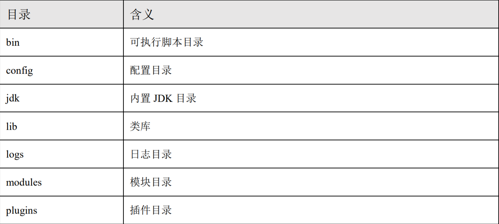
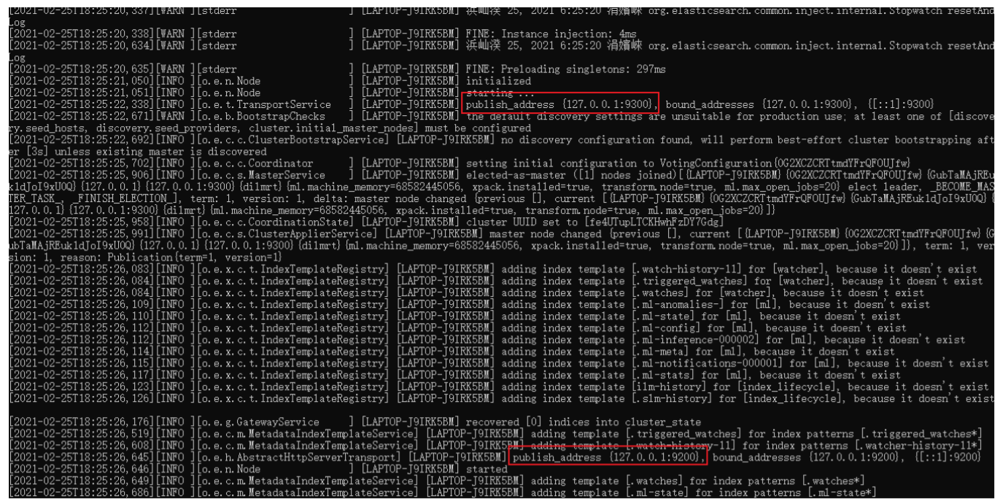
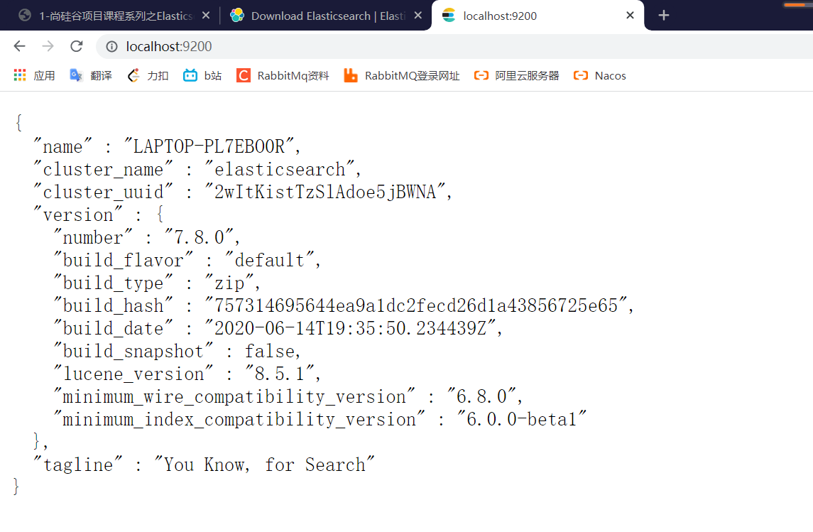
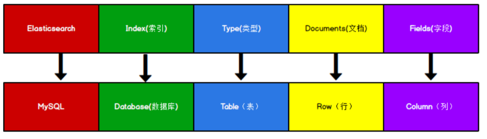
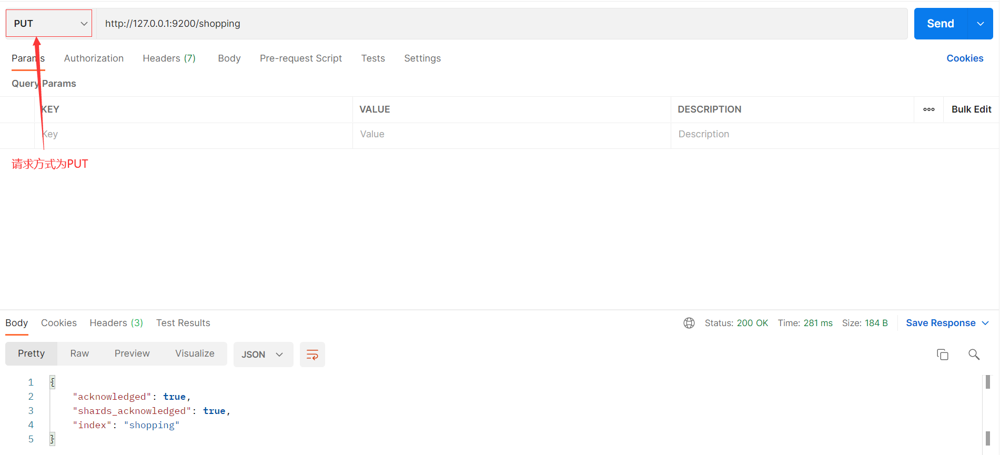
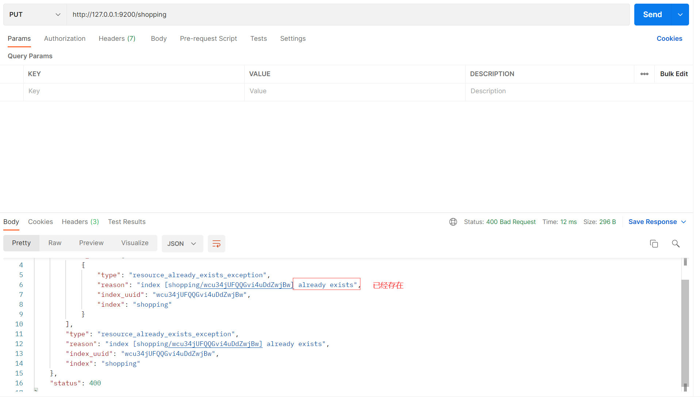
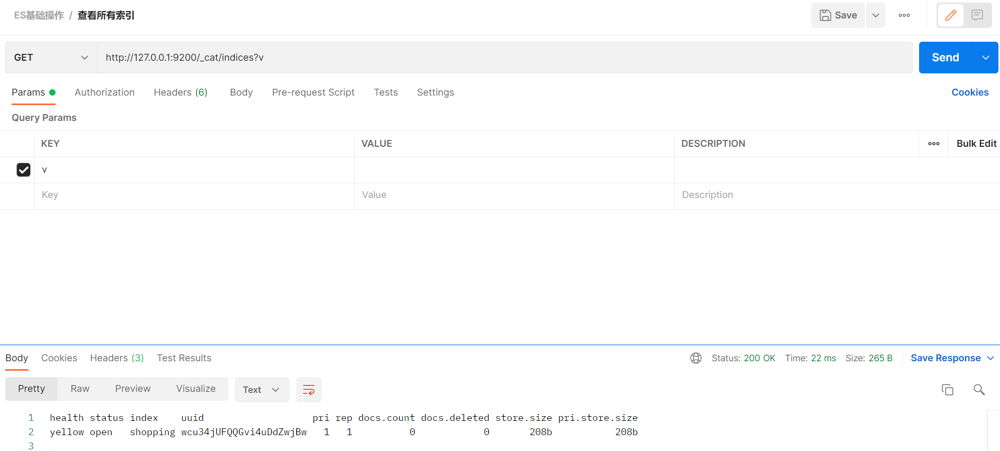
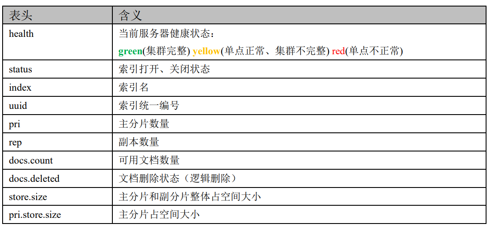

## Elasticsearch学习

### 2.1 Elasticsearch 安装

#### 2.1.1 下载软件

​		Elasticsearch 的官方地址：https://www.elastic.co/cn/

​		下载地址：https://www.elastic.co/cn/downloads/past-releases#elasticsearch

#### 2.1.2 安装软件

​		Windows 版的 Elasticsearch 的安装很简单，解压即安装完毕，解压后的 Elasticsearch 的 目录结构如下




​		解压后，进入 bin 文件目录，点击 elasticsearch.bat 文件启动 ES 服务



**注意：9300 端口为 Elasticsearch 集群间组件的通信端口，9200 端口为浏览器访问的 http 协议 RESTful 端口。**

​		打开浏览器（推荐使用谷歌浏览器），输入地址：http://localhost:9200，测试结果



### 2.2 Elasticsearch 基本操作

#### 2.2.1 数据格式 

​		Elasticsearch 是面向文档型数据库，一条数据在这里就是一个文档。为了方便大家理解， 我们将 Elasticsearch 里存储文档数据和关系型数据库 MySQL 存储数据的概念进行一个类比



​		ES 里的 Index 可以看做一个库，而 Types 相当于表，Documents 则相当于表的行。 这里 Types 的概念已经被逐渐弱化，Elasticsearch 6.X 中，一个 index 下已经只能包含一个 type，Elasticsearch 7.X 中, Type 的概念已经被删除了。

#### 2.2.2 索引操作

##### a. 创建索引

​			对比关系型数据库，创建索引就等同于创建数据库 在 Postman 中，向 ES 服务器发 PUT 请求 ：http://127.0.0.1:9200/shopping



```json
{ 
 "acknowledged"【响应结果】: true, # true 操作成功 
 "shards_acknowledged"【分片结果】: true, # 分片操作成功 
 "index"【索引名称】: "shopping" 
}
# 注意：创建索引库的分片数默认 1 片，在 7.0.0 之前的 Elasticsearch 版本中，默认 5 片
```

​			如果重复添加索引，会返回错误信息，如下：



##### b. 查看所有索引

​			在 Postman 中，向 ES 服务器发 GET 请求 ：http://127.0.0.1:9200/_cat/indices?v

​			这里请求路径中的_cat 表示查看的意思，indices 表示索引，所以整体含义就是查看当前 ES 服务器中的所有索引，就好像 MySQL 中的 show tables 的感觉，服务器响应结果如下





##### c. 查看单个索引、删除索引

将创建单个索引的 PUT 请求换成 GET、DELETE 就行。

#### 2.2.3 文档操作

##### 1）创建文档

在 Postman 中，向 ES 服务器发 `POST `请求 ：http://127.0.0.1:9200/shopping/_doc 请求体内容为：

```JSON 
{
 "title":"小米手机",
 "category":"小米",
 "images":"http://www.gulixueyuan.com/xm.jpg",
 "price":3999.00
}
```

服务器响应结果如下：


```json
{
 "_index"【索引】: "shopping",
 "_type"【类型-文档】: "_doc",
 "_id"【唯一标识】: "Xhsa2ncBlvF_7lxyCE9G", #可以类比为 MySQL 中的主键，随机生成
 "_version"【版本】: 1,
 "result"【结果】: "created", #这里的 create 表示创建成功
 "_shards"【分片】: {
 "total"【分片 - 总数】: 2,
 "successful"【分片 - 成功】: 1,
 "failed"【分片 - 失败】: 0
 },
 "_seq_no": 0,
 "_primary_term": 1
}

```

上面的数据创建后，由于没有指定数据唯一性标识（**ID**），默认情况下，ES 服务器会随机 生成一个。 如果想要自定义唯一性标识，需要在创建时指定：http://127.0.0.1:9200/shopping/_doc/1


##### 2)   查看文档

在 Postman 中，向 ES 服务器发 GET 请求 ：http://127.0.0.1:9200/shopping/_doc/1001


查询成功后，服务器响应结果：


##### 3）修改文档

和新增文档一样，输入相同的 URL 地址请求，如果请求体变化，会将原有的数据内容覆盖 在 Postman 中，向 ES 服务器发 POST 请求 ：http://127.0.0.1:9200/shopping/_doc/1


##### 4）查询所有文档数据

在 Postman 中，向 ES 服务器发 GET 请求 ：http://127.0.0.1:9200/shopping/_search


查询成功后，服务器响应结果：


##### 5）修改文档一个字段

修改数据时，也可以只修改某一给条数据的局部信息

在 Postman 中，向 ES 服务器发 POST 请求 ：http://127.0.0.1:9200/shopping/_update/1001 请求体内容为：

```JSON
{ 
 "doc": {
 "price":3000.00
 } 
}

```


修改成功后文档数据：


